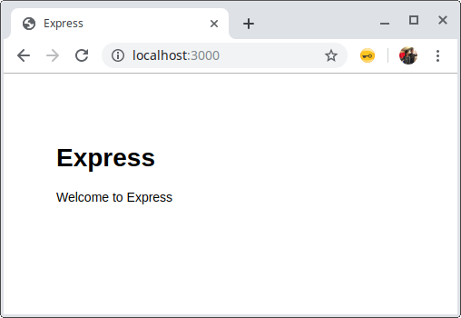
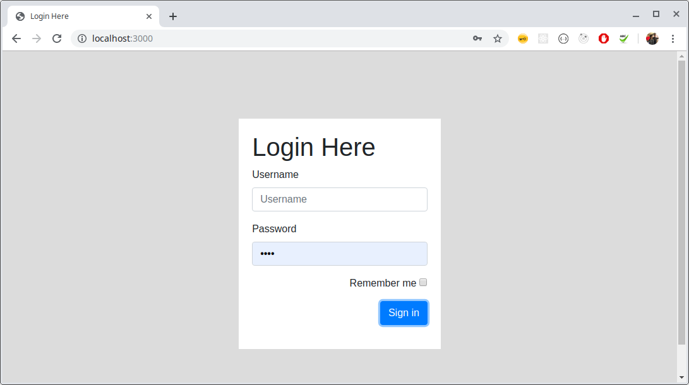

# Express login

Clone this repo or follow the steps below to learn about setting up a Node/express app that enables login, logout and secure routes.

| step          | instruction                                 |
| ------------- | ------------------------------------------- |
| **boilerplating** | These steps will set up an initial project. |
| 0.1 | Install [express-generator](https://www.npmjs.com/package/express-generator) globally `npm install -g express-generator`|
| 0.2 | Create a new project named **login** in a new folder **login** and add pug support (instead of Jade). `express -css=less --view=pug --git login` |
| 0.3 | Install dependencies by executing `npm i` after moving into the directory using `cd login` |
| 0.4 | You will see warnings, depending on how many vulnerabilities are found.  `npm notice created a lockfile as package-lock.json. You should commit this file. ` `added 118 packages from 174 contributors and audited 247 packages in 10.793s ` `found 1 low severity vulnerability run npm audit fix to fix them, or npm audit for details`  after running `npm audit` you will see recommendations to fix, you might want to run `npm ls` to see the dependency tree. In this case you can fix it by running `npm i pug@latest`  After running this no vulnerabilities are reported and we can go ahead and start the app |
| 0.5 | start the app by one of the following commands:   1. `npm start` - *to start app on default port 3000* 2. `PORT=8080 npm start` - *to start on port 8080* 3. `DEBUG=login:* npm start` - *start with debug information*|
| 0.6 | Point your browser to `localhost:3000`    In our console we see: `~/login$ DEBUG=login:* npm start`  `> login@0.0.0 start /home/gius/login` `> node ./bin/www`  `  login:server Listening on port 3000 +0ms` `GET / 304 719.979 ms - -` `GET /stylesheets/style.css 304 7.148 ms - -`
| create login form | After completing these steps we have a new page and route.|
| 1.1 | run `npm i --save express-session bootstrap` to add the dependency Note that bootstrap has 2 peer dependencies: jquery and popper.js. We don't need these, because we are just going to use the css. This is a list of ways to handle the `npm WARN`: 1. Ignore the warnings; *not desired because the team will ignore all npm output* 2. Install peer deps: `npm i --save jquery popper.js`; *not desired; packers will include jquery and popper.js and let the codebase grow significantly* 3. Install as dev deps: `npm i -D jquery popper.js`; *Unsure yet if it solves 2, but it shuts up the WARN* 4. Use [ignore-warings](https://github.com/codejamninja/ignore-warnings): *Unclear [how to use](https://github.com/codejamninja/ignore-warnings/issues/2) yet, but it seems like a legit way of avoiding 2 and still keep npm output clean* 5. use bootstrap cdn; *Preferred to install locally to allow offline dev* 6. manual install bootstrap; *deps should be in package.json for keeping all updatable and visable for npm audit*|
| 1.2 | create `/views/login.pug` [see change](https://github.com/rkristelijn/login/commit/e3c94bb22d43140f0a18054c793572fca60ce7ae#diff-6d5d452b8670045112ed889367008056) |
| 1.3 | add the route to `app.js` for reroute to login, bootstrap and include session [see change](https://github.com/rkristelijn/login/commit/e3c94bb22d43140f0a18054c793572fca60ce7ae#diff-0364f57fbff2fabbe941ed20c328ef1a)  |
| 1.4 | update styles `public/style.css` [see change](https://github.com/rkristelijn/login/commit/e3c94bb22d43140f0a18054c793572fca60ce7ae#diff-0aaa9d35a8082eda23139c53348d2e51) |
| 1.5 | update layout.pug to include bootstrap `views/layout.pug` [see change](https://github.com/rkristelijn/login/commit/e3c94bb22d43140f0a18054c793572fca60ce7ae#diff-5c5792469bc79f8d2ab44b4192b02a20) |
| 1.6 | current result routes default route to login  `~/login $ DEBUG=login:* npm start -s` `  login:server Listening on port 3000 +0ms` `GET / 304 737.652 ms - -` `GET /css/bootstrap.min.css 304 ` `.766 ms - -` `GET /stylesheets/style.css 304 1.070 ms - -` |

# Sources

1. [original tutorial](http://projectsplaza.com/login-logout-nodejs-express/)
2. [another tutor from Nima HKH](https://medium.com/@nima.2004hkh/create-your-first-login-page-with-exprerssjs-pug-f42250229486)
